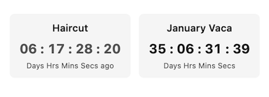

# Countdown Timer

A simple countdown timer plugin for Obsidian.

Perfect for dashboard homepages to track upcoming vacations, project deadlines, and due dates—no more clunky iframes needed.



*Built with Claude Opus 4.5*

## Usage

~~~markdown
```countdown
title: My Vacation
date: 01/15/2026
```
~~~

| Parameter | Description |
|-----------|-------------|
| `title` | Label above the timer |
| `date` | Target date |
| `time` | Target time (optional, HH:MM:SS) |

## Settings

- **Date format** — YYYY-MM-DD, MM/DD/YYYY, or DD/MM/YYYY
- **Show title** — Toggle title visibility
- **Show labels** — Toggle "Days Hrs Mins Secs" labels
- **When countdown expires** — Count up or show "Complete!"

## Tips

- Place countdown blocks on consecutive lines (no blank lines) to display side by side
- Works in Reading view only

## Installation

1. Copy `main.js`, `manifest.json`, and `styles.css` to `.obsidian/plugins/countdown-timer/`
2. Enable in Settings → Community plugins
